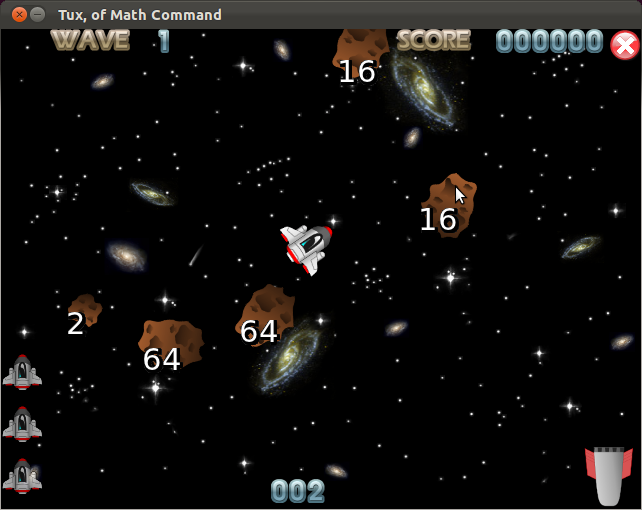
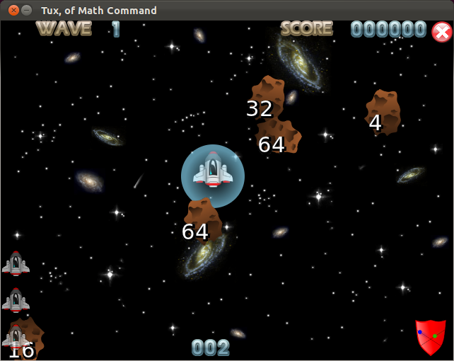

.. image:: img/asteroid.png
   :align: right

.. _factoroids:

Factoroids
----------

Factoriods is a completely separate game mode that is very similar to 
the game 'Asteroids', and helps you learn your prime factors.

When you start this gamemode, you should be presented with something
like this:

The top of the screen is the same as in the standard gamemode, showing 
the wave counter and your current score. The rest of the screen, however,
is vastly different. In the bottom left of the screen is your life meter,
which shows how many lives you have until game over. At the bottom center
of the screen is the currently selected prime factor weapon - this will be
explained in a bit. In the bottom right is the current powerup, which will
also be explained later Finally, the game screen, which should be familiar 
to anybody who has played Asteroids. The ship in the center is controlled
by you, and the astroids flying around are what you must destroy.

Contolling the ship can be done with either the mouse or the keyboard. If
you use the mouse, the controls are as follows:

* Moving the mouse side to side rotates the ship.
* The left mouse button fires the current weapon.
* The right mouse button applies thrust.
* Scrolling the mouse wheel changes the current weapon.

If you use the keyboard, then use the arrow keys to move, [D] and [F] to 
scroll between weapons, and [SPACE] to fire.

In this game, your ship is fitted with a set of six Prime Number Guns: 2, 3, 
5, 7, 11, and 13. To split an asteroid, you need to shoot it with one of its
prime factors - it will then split into this prime factor and the remaining 
number. For example, shooting an astroid with the number 16 on it with the 2
gun will split it into a 2 asteroid and an 8 asteroid. When you shoot a prime
number asteroid - the smallest type of asteroid - with the correct weapon, it 
will be destroyed completely. When you destroy all of the asteroids, you will
advance to the next wave.

In the starting wave, you are only fitted with the 2 gun, so the asteroids are
all powers of 2. In each progressive wave, you get fitted with an extra weapon,
and the astroids come in different powers or multiples. Eventually, you will
get all six weapons and the game will really get hard.

At the start of each wave - including the first one - you will be awarded
with a powerup. There are three different powerups: shields, stealth, and a
smart bomb.

In this example, the shield powerup is being used, as you can see by the
forcefield around the ship and the shield icon in the bottom right of the screen.

This: 

.. image:: img/shield.png

is the shield powerup, which allows you to smash through rocks like a 
battering ram.

This:

.. image:: img/stealth.png

is the stealth powerup, which allows you to pass through rocks unharmed,

and this:

.. image:: img/powerbomb.png

is the smartbomb powerup, which destroys all asteroids than can be destroyed
with the currently selected prime number gun.

You can only hold one powerup at a time, so be sure to use them when you have them!
