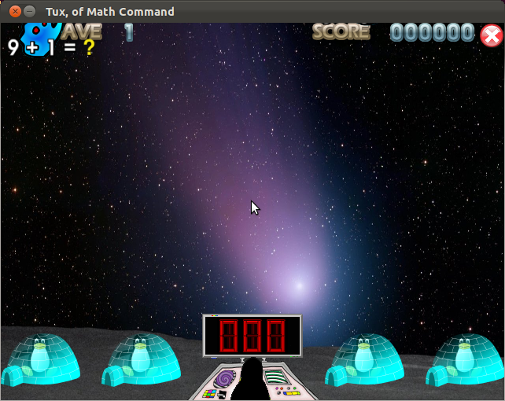
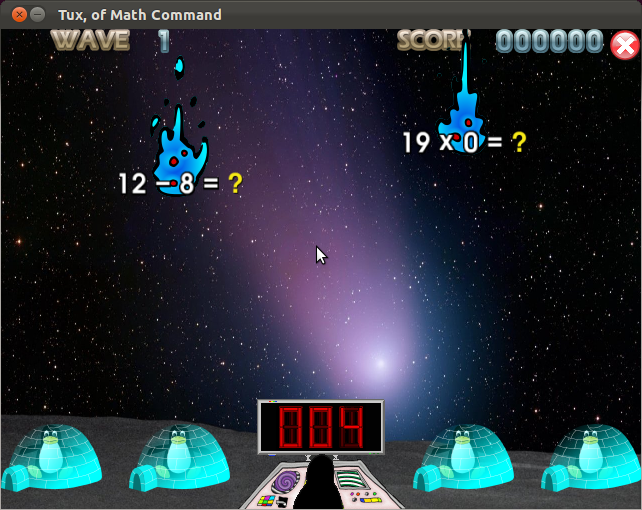
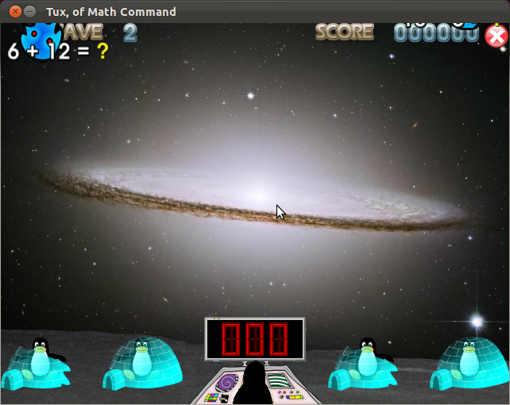
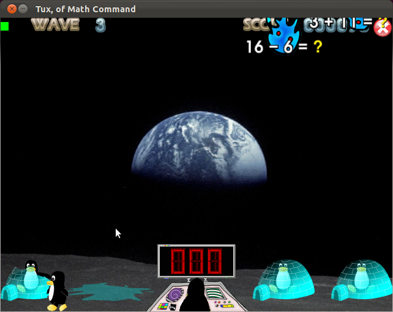
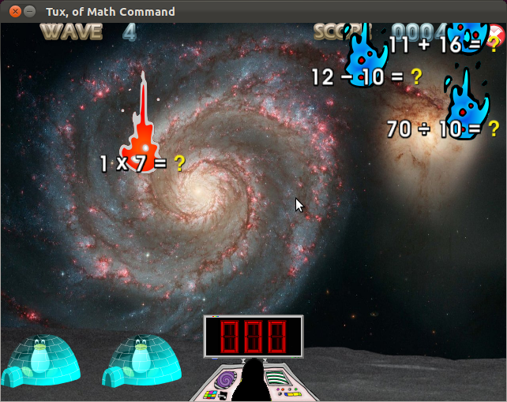

.. image:: img/comet.png
   :scale: 80%
   :align: right

.. _howtoplay:

How to Play
-----------

The main game is heavily based off the old arcade game, 'Missile 
Command', and helps you learn and improve basic maths skills.

When the game starts, it will look something along the lines of this:

This particular screenshot is from an arcade game at Ranger difficulty.

At the bottom of the screen is a row of 4 igloos with a red LED display
in the centre. Tux the Penguin is at the display, ready to type in 
numbers and save the igloos. 

At the top left of the screen is a meteor starting to appear, with the
sum "9 + 9 = ?" written on it.

Slightly obscured by the metor is the wave counter, which shows the wave
you are currently on. To advance to the next wave, destroy all the meteors
on the current wave.

In the top right of the screen is your score meter and a red cross. Click
the cross to exit the game.

On a 'mission' based gamemode, there is also a counter in the top-middle
that tells you how many questions you have left in that round.

To play the game, you need to type the answer to a sum on your keyboard. The
numbers will then appear on the red LED display, as in the picture below.

As you can see, 4 has been typed in to the display, which is the answer to
"12 - 8 = ?". To complete an answer, press [ENTER] or [SPACE] and Tux will
fire a laser at the corresponding asteroid. If the answer is wrong, it will
fire straight up and do nothing. To clear an answer, press [BACKSPACE] or 
[DELETE].

If you have no keyboard, or you wish to use a touchscreen device, you can
launch the game from the command line with the option '--keypad'. This displays
an on-screen keypad in game, which can be clicked on with the mouse instead of
using a keyboard.

If an asteroid gets close to one of the igloos, the asteroid will start to 
flash, warning you. If an astroid hits an igloo, the igloo will melt - but
don't worry, the penguin inside is safe for now.

However, if an astroid hits an igloo a second time, then the igloo will be
completely destroyed and the penguin will walk off the screen.

Be careful, becuase if you lose all of your igloos, the game is lost! Don't 
worry if you lose one or two though: if you can destroy a bonus astroid, you
can repair an igloo and get yourself an extra life.

The progress towards a bonus asteroid is indicated by a green bar in the top
left of the screen. Destroy lots of normal asteroids, and it'll fill up. When
it's full, you get a bonus. Be quick, because bonus asteroids move faster than
normal ones!

If you're really lucky during an Arcade game, you might see a special yellow
comet fly rapidly accross the screen. If you're quick enough to shoot it down,
you'll earn yourself a single use smart bomb powerup. Simply press [SHIFT], and
it'll destroy every asteroid on the screen!

In an arcade game, the questions are randomly generated and the game will end
when all of your igloos are destroyed, but in the Training Academy games the
questions are taken from a list and the game is won when all the questions have
been answered correctly. If it is not answered, it will be replaced randomly in
the list.

