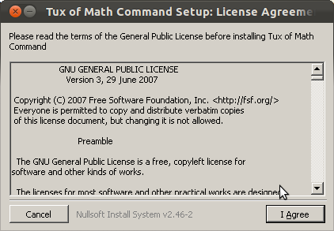

Getting TuxMath
===============

.. image:: img/console_bash.png
   :scale: 90%
   :align: right

Before you can play TuxMath, you need to download it and install it.
If you've already done this, you can skip this section and go
straight to :doc:`starting`. 

Otherwise, find your operating system below and read on.

Windows and OS X
----------------

On Windows or Mac OS X, you need to point your browser to 
http://tux4kids.alioth.debian.org/tuxmath/download.php, find the relevant
executable for your operating system, download it, and run it.

On Windows, you should get an install window that looks similar to this:

Follow the instructions to install TuxMath, and then either run 'TuxMath.exe'
or find 'TuxMath' in the start menu. 

An alternative install method for OS X is to install MacPorts 
(http://www.macports.org) and type::

	sudo port install tuxmath

into a console window.

Linux
-----

On Linux, you can install TuxMath by simply typing either::

	sudo aptitude install tuxmath

or::

	sudo apt-get install tuxmath

into a console, depending on the distribution to use. Alternatively, 
you can search for TuxMath in the Ubuntu Software Centre or similar.

To run it, simply type 'tuxmath'. To launch it in a window, add the 
option '--windowed'.

Building from source
^^^^^^^^^^^^^^^^^^^^

If you know what you are doing, you can build TuxMath yourself from the
source tarball available on the website. It also requires the t4k_common
library, which is also available.

Check the README and INSTALL files for the list of required libs, and run::
	
	./configure
	make
	sudo make install

As before, type 'tuxmath' to run it.
