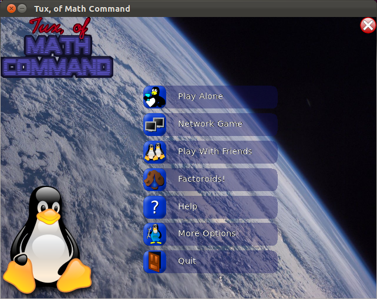
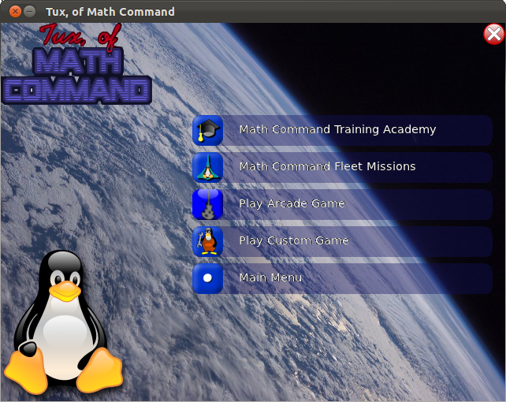

.. image:: img/tux-yes.png
   :align: right

Starting A Game
===============

The Main Menu
-------------

When you launch TuxMath, you should see a loading screen and
then be presented with the main menu:

Your menu might be split into separate pages, depending on the
size of your screen.

To navigate the menus either use the mouse or keyboard. Use the 
[UP] and [DOWN] arrow keys to move between options, and [ENTER] 
or [SPACEBAR] to select them. You can also use 'J' and 'K' to 
move up and down, respectively. [ESCAPE] will go back a level.

The main menu options are as follows:

* Play Alone
	Choose this to get to the Single Player menu. 
	(See :ref:`singleplayer`)

* Network Game
	Choose this to start a multiplayer game across a 
	network (See :ref:`multiplayer`)

* Play With Friends
	Choose this to start a local multiplayer game on the
	same computer (See :ref:`multiplayer`)

* Factoroids!
	Choose this to play factoroids, the astroids like 
	'mini-game'. (See :ref:`factoroids`)

* Help
	Choose this to get a short tutorial teaching you how
	to play the main comet game. (See :ref:`howtoplay`)

* More Options
	Choose this to get a list of options not related to the
	maths. Eventually, this will include things such as volume
	or fullscreen/windowed.

* Quit
	Choose this to quit the game.

.. _singleplayer:

Single Player
-------------

After clicking Play Alone you will be presented with this screen 
where you need to choose your game mode:

* Math Command Training Academy
	Choose this for a list of over 50 prepared lessons, starting
	simple and progressively getting harder and adding new 
	types of questions (for example missing number questions").
	Gold stars are awarded when the tasks are completed.

* Math Command Fleet Missions
	Choose this for a series of more advanced missions tied 
	together by a fun storyline. The fate of the galaxy is in
	your hands!

* Play Arcade Game
	Choose this to select from one of five open ended games 
	where the goal is to get as high a score as possible.
	There are 5 difficultly levels to choose from:

	* Space Cadet
		Simple Addition

	* Scout
		Addition and Subtraction up to 10

	* Ranger
		Addition, Subtraction, Multiplication and Division
		up to 10

	* Ace
		All 4 operands with numebers up to 20, and negative
		numbers and 'missing number' questions

	* Commando
		All of the above plus questions with multiple operands 

* Play Custom Game
	Choose this to start a custom game based on the config file in 
	your home directory. (See :ref:`configuration`)

Once you've chosen a game mode, (and, where necessary, a mission or
difficulty) the game will start. Read :ref:`howtoplay` to find out
what to do.

.. _multiplayer:

Multiplayer
-----------

Multiplayer games can either be played across a network, or locally on
the same machine. The game is played in the same way as the standard
single player game (See :ref:`howtoplay`), but with a few differences 
depending on what you decide to do.

Network Play
^^^^^^^^^^^^

To set up a network game, the tuxmath server software needs to be started.
To do this, go to Network Game -> Run Server. First you will need to enter 
a name for the server. This is to identify to players when they try to
connect. Next, if possible, you will be asked to choose the lesson file
for your server. If not, it will simply use the default.

To join a game across a network, simply go to Network Game -> Join Game, and
TuxMath should provide a list of servers running on the network. Choose one, 
and then you will be asked to enter a nickname to identify yourself to the
other players in the game. Finally, you will need to indicate that you are
ready to start the game. While waiting for everybody to say they are ready, a 
list of the currently connected players is shown.

When the game starts, each player will be presented with the same questions,
the person who answers them first will get the points, and the player with the
most points wins. The gameplay is also cooperative, however, as all players
need to help defend the igloos.

Please note that while network play does work, it needs more testing and some
aspects have not yet been adressed:

* While a network game is in progress, playing a non-network game on the same
  computer is a bad idea and will confuse TuxMath. It is fine, however, to 
  play in the network game from the same computer that is hosting it.

* Quitting the server program while others are still playing in the game is also
  a bad idea.

* The server software can be launched on linux with the command 'tuxmathserver', 
  which avoids any problems with thread-safety, but can currently only use the 
  default question list settings.

Play With Friends
^^^^^^^^^^^^^^^^^

This mode allows you to play competitively  with your friends on the same 
computer, by taking turns at the end of each round. There are two types of this
mode: Score Sweep and Elimination. Score Sweep is a simple mode in which the 
winner is the player with the most points after the final round. In Elimination,
the player with the least amount of points is removed from the game after each
round, and the last player standing wins.

This mode also lets you choose the difficulty instead of a lesson, and the 
difficulty settings are the same as in an Arcade game.

